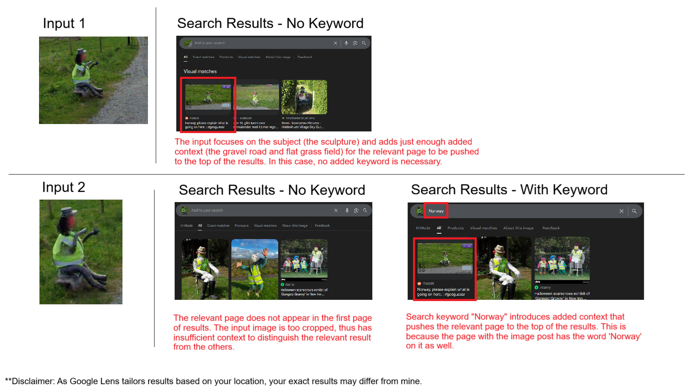

# Solution

This challenge is designed to be easy difficulty. The service accepts answers to 3d.p. so I will provide my answers in 3d.p. but link the precise streetview image.

#### Key Learning Outcomes
Most panoramas can be solved to some degree with Reverse Image Search (RIS) using Google Lens. RIS is an extremely powerful took, but the key takeaway is *when* and *how* RIS is useful. 

**RIS is most useful when you have a unique POI whose photograph has been indexed by the Search Engine** (i.e. image of the POI and image context have been crawled and added to the search engine's search database). 

The images in this challenge are chosen to illustrate different reasons an image could have been indexed by Google, including: famous landmark, forum post, Wikipedia Commons, etc. RIS is powerful, but can also be finnicky, and heavily dependent on the precise image input, input keywords and the search engine it's powered by. We'll see examples of this and how to navigate it in a bit.

### 1. tree

1. Reverse image search the church - it is the **Church of Chonchi**, a National Monument of Chile

**Answer: Chonchi, Los Lagos Region, Chile** [-42.624,-73.773](https://maps.app.goo.gl/oL4VWEbAmoknenDSA)

*NOTE: The indented square concrete poles and Chilotan architecture also point to Chiloé, Chile. The wood building right next to the Christmas tree can also be reverse image searched.*

### 2. reindeer

1. Long white dashed outer road lines, coastal grasslands vegetation - northern **Norway**
2. Identify that the policeman 'sculpture' by the side of the road is the most unique POI in the image.
3. Reverse image search the sculpture. When using RIS on a POI that's a bit niche, it's advisable to try **different crops of the image** and try **using additional input keywords** to supplement context for your search. For example:

4. A successful search will lead to [this reddit post.](https://www.reddit.com/r/geoguessr/comments/rao1il/norway_please_explain_what_is_going_on_here/) The photosphere is linked in one of the comments.

**Answer: Isnestoften, Finnmark County, Norway** [70.133,22.990](https://maps.app.goo.gl/KHZDcA2Qwh654KjH9)

### 3. snow

*This one's fun! Here we have our first and only user-submitted photosphere for this challenge.*

1. There is a plane with these words on it: "Alaska", "Everts Air Fuel", "N251CE"
2. Therefore, we are in an **airport in Alaska** that is serviced by **Everts Air**, and is/was visited by a plane with the **registration number N251CE**.

Based on all that, here are 2 possible solutions:
1. The [Everts Air website](https://evertsair.com/cargo/destinations-map) has a list of destinations and places it provides "connecting service" to. Check them one by one. Lucky for you, Allakaket Airport is one of the first ones listed.
2. Search for flight history of the plane N251CE. Depending on when you're running this query, helpful data may or may not be behind a paywall.

**Answer: Allakaket Airport, State of Alaska, USA** [66.550,-152.632](https://maps.app.goo.gl/kZrpQPwF4EPSQqDR9)

*BONUS: RIS works using [Yandex RIS](https://yandex.com/images/) but not with Google Lens. This is because the image was featured in [this video](https://anna-news.info/opyat-oni-tyoploe-s-myagkim-sravnivayut/) posted to a Russian site, and Yandex RIS has a strong bias for serving Russian/ eastern European sites as results. Thank you to the participant (@plzentertext) who found this unintended solve! It's a great example of RIS being impacted by its search engine.*

### 4. santa

**Solution 1**  
1. Reverse image search the green house and the road next to it. Even tiny villages can have some kind of digital footprint; usually a photo of their **main road, main religious building or main square** is [hosted on Wikipedia](https://commons.wikimedia.org/wiki/File:5362Longos,_Kalayaan,_Laguna_41.jpg) - **Longos, Kalayaan**
2. We are on a **main road** (since it's paved and has bidirectional, multi-lane traffic), so search the R-5 highway that cuts through Longos. 

**Solution 2**
1. Reverse image search the Chef's M Pizzeria logo leads to [this facebook post](https://www.facebook.com/groups/3056314867767357/posts/8960886210643497/) advertising pizza delivery service for **Longos, Kalayaan**  

**Solution 3**  
1. The jeepney has the words "Siniloan Sta Cruz" - it services the route between **Siniloan** and **Santa Cruz**, two municipalities in the province of **Laguna, Philippines**.
2. Correctly identify the building in the image is a Christmas shop. Alternatively, notice there's a Petron petrol station in the distance up the hill.
3. On Google Maps, search either 'Christmas Shop' or 'Petron' over the area between the two municipalities.

**Answer: Longos, Laguna Province, Philippines** [14.340,121.483](https://maps.app.goo.gl/vr2BLZchj1JM6csf9)  

*NOTE: It is also entirely possible, though more tedious, to narrow down the route between Siniloan and Santa Cruz based on the terrain observed. Most parts of that route are far too flat and open - the road in our image rides along the base of a mountain on one side. Only the road between Paete and Lumban matches this terrain.*

### 5. crab
*come on, did you really think I could write a Christmas themed challenge without Christmas Island?*

1. Red crab migration - Christmas Island
2. We are on the only boat ramp on the island - Ethel Beach boat ramp

**Answer: Ethel Beach boat ramp, Christmas Island, Australia**  [-10.464,105.708](https://maps.app.goo.gl/nw5xMspDAJgBdkkk8)