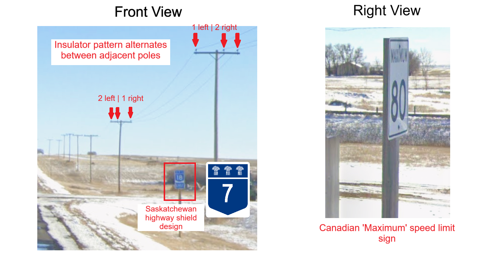
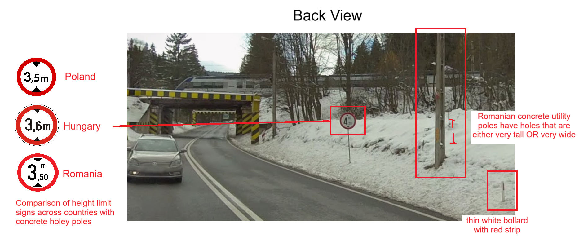
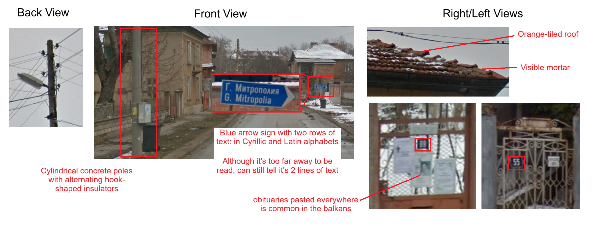

# Solution

This challenge is designed to be medium/hard difficulty. You only need to solve 5 out of 6 to get the flag but of course I will provide all 6 walk-throughs. The service accepts answers to 3d.p. so I will provide my answers in 3d.p. but link the precise streetview image.


#### Key Learning Outcomes
Continuing from Merry OSINTmas part 1, in this challenge we see more examples of when reverse image search (RIS) does and doesn't work. We also introduce a new tool to deal with visually generic rounds - [Overpass Turbo](https://overpass-turbo.eu/), a tool used to query [Open Street Map](https://www.openstreetmap.org/) (OSM) data. I've put some links in the resources section if you're keen to learn more.

**Overpass Turbo is useful if your image has a sufficiently unique combination of infrastructure features that have all been mapped on OSM.** Examples of infrastructure features include: building, house number, bus stop, road number, rail bridge, etc. The big caveat is that OSM is entirely community-run, so its dataset is not comprehensive... we'll see an example of that later.

This challenge also illustrates the utility of learning **country-specific infrastructure**. 3 of the countries featured are neighboring ones (Hungary, Romania and Bulgaria), which might look similarly eastern-European to the untrained eye. However, as I will outline in this writeup, there are unique features that differentiate them. Learning country-specific infrastructure will help you tell similar regions apart, even when RIS cannot.

### 1. arrow

1. Red-and-white snow arrow on poles, truck that says 札幌 (Sapporo) - **Hokkaido, Japan**
2. The white sign at the end of the bridge tells us we are driving over 余市川 - **Yoichi River**
3. Look along Yoichi River on Google Maps and check all the bridges that cross it.

**Answer: 仁木大橋 Niki Bridge, Hokkaido Prefecture, Japan** [43.158,140.757](https://maps.app.goo.gl/jTq1y1HEs3eUdZ4m9)

### 2. rocks

1. The kilometer marker in front of us says "RN 150 | 350" - we are at **Km 350** of the **Ruta Nacional 150** in **Argentina**
2. Since [RN 150 starts in the town of Patquía](https://es.wikipedia.org/wiki/Ruta_Nacional_150_(Argentina)) we can use Google Maps' 'Directions' feature to measure out a 350km route from Patquía, along the RN 150

**Answer: RN150, San Juan Province, Argentina** [-30.355,-69.704](https://maps.app.goo.gl/fc5BeXe4BzdyGG177)

### 3. maximum


1. 'Maximum' instead of 'speed limit' on speed signs - **Canada**, not USA
2. Blue highway shield design, alternating poletop insulators - **Saskatchewan** Province
3. We are on highway 18 (SK-18) in Saskatchewan, at a spot where the speed limit changes from **50km/h to 80km/h**
4. Build and run Overpass Turbo query
```
{{geocodeArea:Saskatchewan}}->.searchArea;

// find all roads in Saskatchewan with road number 18 and speed limit 80
way['highway']['ref'='18']['maxspeed'='80'](area.searchArea); 

// find all roads with speed limit 50 that are 1 meter (arbitrary short distance) away
way(around:1.0)['highway']['maxspeed'='50'];
out geom;
```

**Answer: Climax, Saskatchewan Province, Canada** [49.205,-108.381](https://maps.app.goo.gl/TpDHeVnqv8AHMCPQ7)  

*ALTERNATIVE SOLUTIONS: this can also be solved by manually going through towns along the SK-18. Or you can reverse image searching the grain elevator and parse through the results. Or if you have good eyesight, you may be able to read the town name (Climax) on the building.*

### 4. crossing

1. Concrete utility poles with **medium**-sized holes - **Hungary**

**Solution 1**  
Reverse image search the train station - **Tornanádaska** Station  

**Solution 2**  
On Google Maps streetview, [snow coverage in Hungary](https://www.plonkit.net/hungary#3) is mostly in the north, and with the railway tracks running next to the road we are most certainly around Tornanádaska or its neighboring towns.  

**Solution 3: Bonus**  
Just for fun, I thought I'd write a Overpass Turbo query. We are near a rail crossing, two bus stops and a train station.
```
{{geocodeArea:Hungary}}->.searchArea;

// find all train stations in Hungary
nwr["building"="train_station"](area.searchArea);
// find all railway crossings near train stations
node(around:100.00)["railway"="level_crossing"]->.crossings;

// for each railway crossing
foreach.crossings->.crossing(
  // find all bus stops near each railway crossing
  node(around.crossing:50)["bus"="yes"];
  // if there are at least 2 bus stops nearby
  if(count(nodes)>=2){
    (.crossing;);
    // output railway crossing
    out meta;
  }
);
```
The code will output 8 locations.

**Answer: Tornanádaska, Borsod-Abaúj-Zemplén County, Hungary** [48.558,20.788](https://maps.app.goo.gl/WwcRC7Tv1dCt8pUq5)

### 5. height


1. Concrete utility pole with **tall** holes, white bollard with red strip, Romanian height limit sign - **Romania**
2. The road passing under the railway bridge has a maximum height of 4.2m.
3. Write Overpass Turbo query. There are 8 results.
```
{{geocodeArea:Romania}}->.searchArea;

// Search for roads in Romania with a max height of 4.2
way["highway"]["maxheight"="4.2"](area.searchArea);

// return all rail bridges near the roads
way(around:10.00)["bridge"="yes"]["railway"="rail"];
out center;
```

**Answer: Timișu de Sus, Brașov County, Romania** [45.526,25.576](https://maps.app.goo.gl/w9e3FuAPSkB1ah3u7)


### 6. gates


1. Blue arrow-shaped direction signs with 2 lines of text, obituaries everywhere, cylindrical concrete poles with alternating hook insulators, poorly constructed orange tile roofs with visible mortar - **Bulgaria**
2. Observe that the gates on either side of us have the house number displayed on a dark blue tag. We are next to **house #55 and #88**.
3. Write Overpass Turbo query. This will output 9 buildings.
```
{{geocodeArea:Bulgaria}}->.searchArea;

// find buildings in Bulgaria with house number 88
nwr["building"]["addr:housenumber"="88"](area.searchArea);
// find all buildings nearby that have house number 55
nwr(around:50.00)["building"]["addr:housenumber"="55"];
out center;
```

**Answer: Dolna Mitropoliya, Pleven Province, Bulgaria** [43.469,24.518](https://maps.app.goo.gl/yL4scNwcjMmnNsW4A)

*NOTE: Bulgaria is a country that's not well mapped out on OSM. This is why the query (rather conveniently) only produces 9 results. There are likely more areas where #88 and #55 houses are next to each other, but those areas just haven't been mapped yet.*


## Resources
1. [Overpass Turbo article with examples](https://publish.obsidian.md/dukera-gewel/How+to+Use+Overpass+Turbo)
2. [Overpass Turbo Wiki Guide](https://wiki.openstreetmap.org/wiki/Overpass_API/Language_Guide)
3. [Plonkit Guide - country specific infrastructure](www.plonkit.net)
